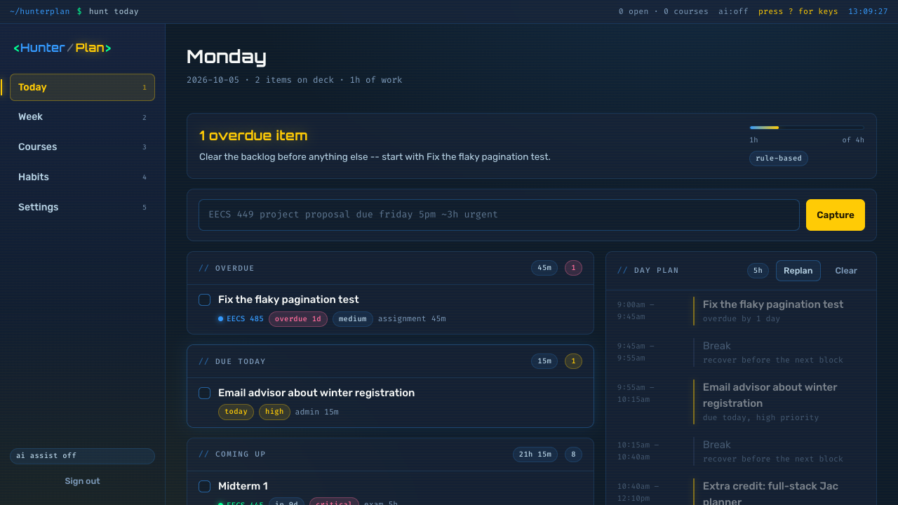
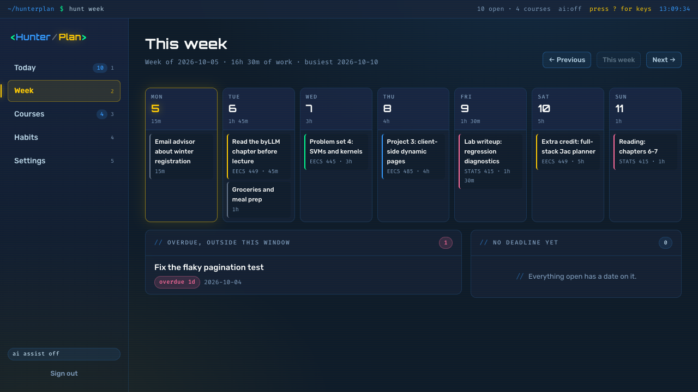
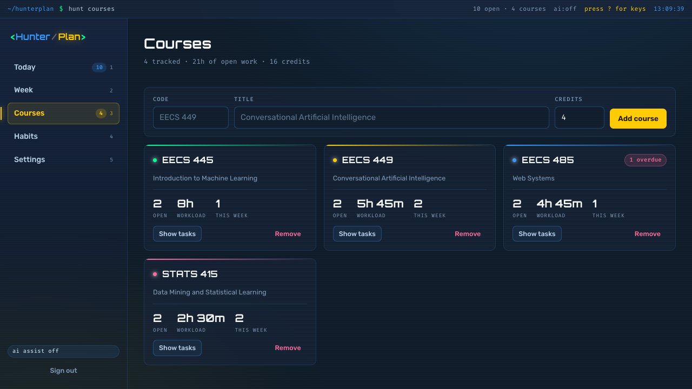
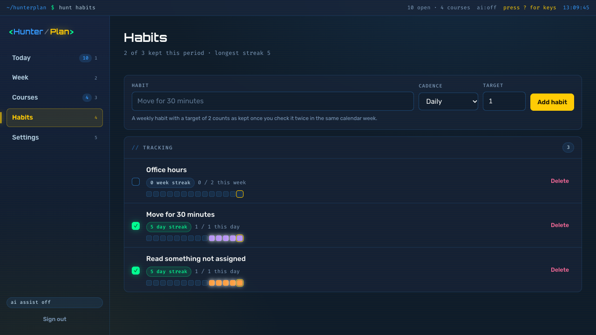
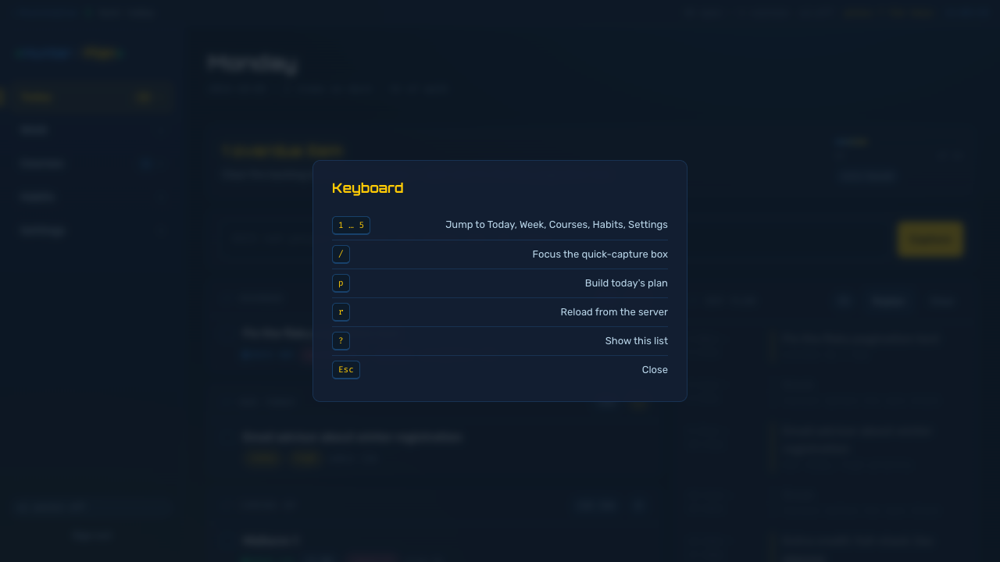
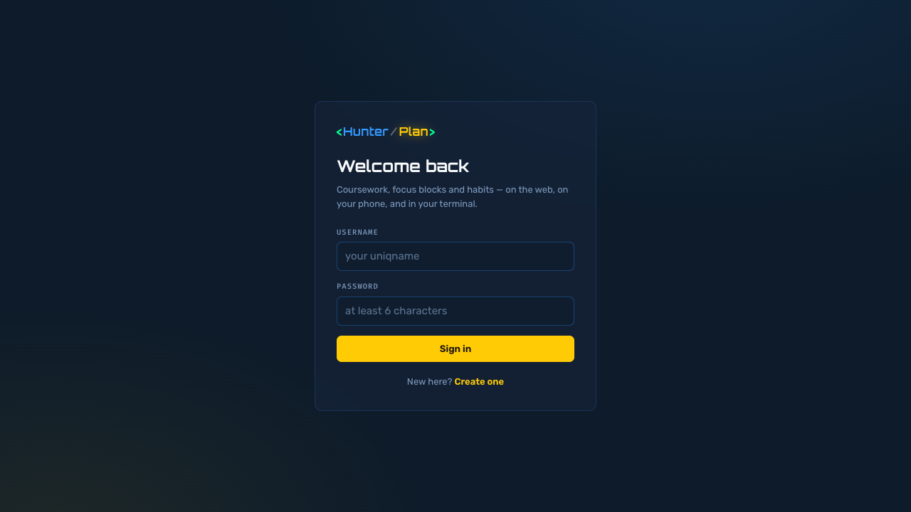
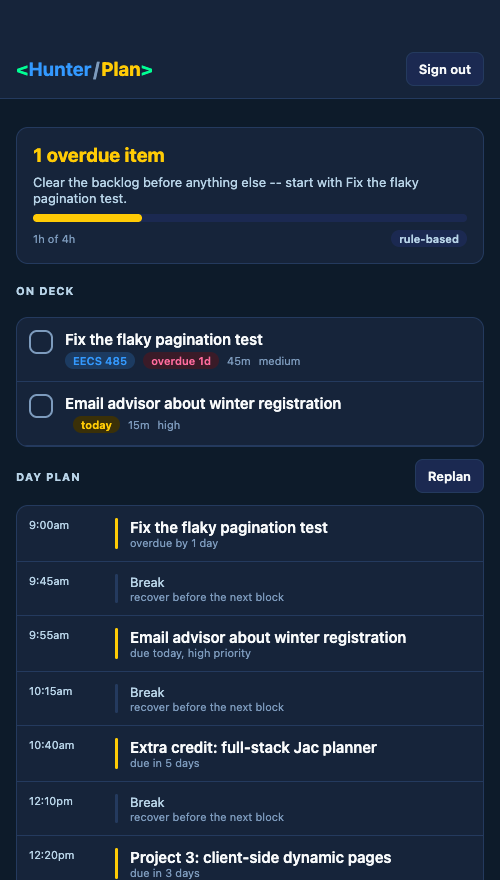
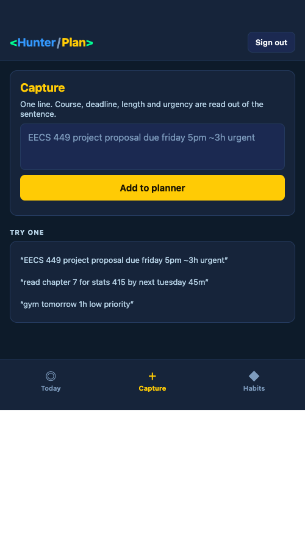

# HunterPlan — a personal academic planner in Jac

**EECS 449 · Extra Credit 1 · Fall 2026**

- **Name:** Hunter Broughton
- **UMID:** `<<FILL IN BEFORE SUBMITTING>>`
- **uniqname:** huntbro

HunterPlan is the planner I actually want for a semester of EECS: it holds my
courses, reads a deadline out of a sentence I typed in a hurry, ranks
everything by how much trouble it will cause me, and carves the day into
focus blocks. One server, one graph, and three front ends over it — a web
app, a phone app, and a CLI.

It wears the same clothes as [hunterbroughton.com](https://hunterbroughton.com):
Michigan maize against neon blue, a monospace terminal strip across the top, a
bracketed `<Hunter/Plan>` wordmark, and the restraint to keep the glow on the
things that matter.



---

## Contents

- [What it does](#what-it-does)
- [Quickstart](#quickstart)
- [Running each component](#running-each-component)
- [CLI reference](#cli-reference)
- [How the four components fit together](#how-the-four-components-fit-together)
- [The AI layer, and why it always works](#the-ai-layer-and-why-it-always-works)
- [Tests](#tests)
- [What I think makes this stand out](#what-i-think-makes-this-stand-out)
- [Project layout](#project-layout)
- [Troubleshooting](#troubleshooting)

---

## What it does

**Capture in one line.** Type `EECS 449 project proposal due friday 5pm ~3h urgent`
into any of the three front ends and HunterPlan files it against the right course,
resolves `friday` to a real date, reads `5pm` as a time, `~3h` as a working
estimate and `urgent` as a priority — then shows you its reading so a wrong
guess is caught immediately instead of silently.

**Ranking that matches how a deadline actually feels.** Every task gets an
`urgency` score blending how close the deadline is (overdue dominates, and
each day late adds more, capped so one forgotten errand cannot outrank a
midterm forever), stated priority, the kind of work it is, and its size. The
score is computed once on the server, so the web list, the phone list, the
terminal list and the day planner all agree on what is most important.

**A day plan, not just a list.** `Build plan` lays your open work into timed
focus blocks between your configured working hours, respects a daily focus
capacity, inserts short and long breaks, and tells you plainly what did not
fit rather than quietly dropping it. Each block carries the reason it earned
its slot (`overdue by 2 days`, `due today, high priority`).

**Breakdowns.** A 5-hour project becomes three to six sequential work
sessions, paced across the runway so the last one lands on the deadline
instead of all of them piling onto it.

**A week view** that buckets deadlines across seven days with per-day
workload, pages forward and back, and surfaces whatever has no deadline yet.

**Courses** with live workload roll-ups — open tasks, total minutes, how many
are overdue, how many land this week.

**Habits** with daily or weekly cadence, a target per period, and streaks that
do not break just because today is not finished yet.

**Per-user accounts.** Every endpoint runs against the caller's own graph, so
two students on one deployment never see each other's work.

<p align="center">
  
  
</p>
<p align="center">
  
</p>

**Built for the keyboard.** `1`–`5` jump between screens, `/` drops the cursor
in the quick-capture box, `p` builds today's plan, `r` reloads, and `?` lists
the lot. Nothing is intercepted while you are typing in a field.

**It tells you where you are.** The day plan draws a live `NOW` marker that
slides down as the afternoon goes, and dims the blocks already behind it, so
one glance says whether you are on plan.

<p align="center">
  
  
</p>

---

## Quickstart

### Prerequisites

- **Jac 0.37.23 or newer.** If you do not have it:
  ```bash
  curl -fsSL https://raw.githubusercontent.com/jaseci-labs/jaseci/main/scripts/install.sh | bash
  ```
  Check with `jac --version`.
- Nothing else. No database, no Docker, **no API key** — see
  [the AI section](#the-ai-layer-and-why-it-always-works).

### Run it

From the repository root:

```bash
jac install     # first time only: fetches npm + python dependencies
jac run         # starts the web app and the planner service
```

> **If `jac install` fails with `ImportError: ... _posixsubprocess ... symbol
> not found`** — a known bug in the Python bundled with some Jac builds on
> macOS arm64, not in this project — create the virtualenv yourself with any
> Python 3 on your machine and re-run. The project has no Python
> dependencies, so an empty environment is enough:
>
> ```bash
> python3 -m venv .jac/venv && jac install
> ```

Open <http://localhost:8000>, click **Create one**, pick any username and
password, and you are in. On the **Settings** page, press **Seed** to fill the
account with a sample term (4 courses, 10 tasks, 3 habits) so there is
something to look at immediately.

`jac run` is all it takes: `default-app = "web"` in `jac.toml`, and the
`planner` service app is colocated into the same process, so one command
brings up the server and the browser client together.

Also worth a look while it is running:

- <http://localhost:8000/docs> — the generated OpenAPI browser for every endpoint
- <http://localhost:8000/graph> — a live picture of the data graph

---

## Running each component

### Web app — `jac run`

The main interface. Five routes behind a file-based router: **Today**,
**Week**, **Courses**, **Habits**, **Settings**. `pages/(auth)/` is an
auth-guarded route group, so an unauthenticated visitor is redirected to
`/login` automatically — and a stored token the server has stopped accepting
sends you back there too, rather than rendering an empty planner.

| Key | Does |
|---|---|
| `1` … `5` | Jump to Today, Week, Courses, Habits, Settings |
| `/` | Focus the quick-capture box |
| `p` | Build today's plan |
| `r` | Reload from the server |
| `?` | Show the shortcut list |

Toggling a task is optimistic: the box fills the moment you click it, and the
refresh behind it either confirms the change or quietly puts it back.

### CLI — `./hunt <command>`

The fastest way in and out of the planner, and the surface I use most.

```bash
./hunt login <username> --register   # first time; drop --register after that
./hunt seed                          # optional sample data
./hunt today
./hunt add "EECS 485 project 4 map reduce due next friday 11:59pm ~6h urgent"
./hunt plan --minutes 300
./hunt done pagination
```

`./hunt` is a one-line wrapper over `jac run cli -- "$@"`; the long form works
identically if you prefer it:

```bash
jac run cli -- today
```

The session (server URL + token) is stored in `~/.hunterplan/session.json` with
owner-only permissions. `HUNTERPLAN_SERVER`, `HUNTERPLAN_TOKEN` and `HUNTERPLAN_HOME`
override it for scripting.

Real output:

```
$ ./hunt today

Sunday, 2026-10-04   1h of work · capacity 4h

  1 overdue item  [rule-based]
  Clear the backlog before anything else -- start with Fix the flaky pagination test.

OVERDUE  (1)
  eac3af  ·  EECS 485   Fix the flaky pagination test           overdue 1d            45m    medium

DUE TODAY  (1)
  393f5e  ·  —          Email advisor about winter registrati…  today                 15m    high

COMING UP  (8)
  1c6d68  ·  EECS 445   Midterm 1                               in 9d                 5h     critical
  79eccb  ·  EECS 449   Extra credit: full-stack Jac planner    in 5d                 5h     critical
  90a0d0  ·  EECS 485   Project 3: client-side dynamic pages    in 3d                 4h     high
  76f94f  ·  EECS 445   Problem set 4: SVMs and kernels         in 2d                 3h     high
  ...

DAY PLAN  (5)
  09:00–09:45  Fix the flaky pagination test
  09:45–09:55  Break
  09:55–10:15  Email advisor about winter registration
  10:15–10:40  Break
  10:40–12:10  Extra credit: full-stack Jac planner
  ...

HABITS  0 of 3 kept
  71200f  ·  Move for 30 minutes          4 streak
  d521c6  ·  Office hours                 0 streak
```

```
$ ./hunt add "EECS 449 project proposal due friday 5pm ~3h urgent"
✔ added Project proposal  [parsed]
  EECS 449 · project · due Fri Oct 9 17:00 · 3h · critical priority
  id 5733cd
```

Tasks are addressed by **id prefix or by a piece of their title**, so you never
have to type a 32-character id: `./hunt done pagination` and
`./hunt split "project proposal"` both work. An ambiguous handle lists the
candidates instead of guessing.

### Mobile app — `jac run --dev --platform web mobile`

A React Native client built entirely from `@jac/mobui` primitives (no HTML, no
CSS), so the same source compiles to a real native app and to a browser
preview.

```bash
# Browser preview -- easiest to grade, no simulator needed.
# Stop `jac run` first: both share the client build directory, so they
# cannot be up at the same time. `jac run` afterwards rebuilds the web app.
jac run --dev --platform web mobile

# Real device / simulator (needs Expo + Xcode or Android SDK):
jac setup mobile
jac run --dev mobile
jac build mobile --platform ios      # or: --platform android
```

The preview prints the URL it chose (`App: http://localhost:8003/` or
similar). Sign in there with the same account you use on the web.

Three tabs — **Today** (briefing, what is due, the day's blocks), **Capture**
(one-line entry with the server's readback), and **Habits** (tap to keep a
streak). It signs in with the same accounts and reads the same graph: complete
a task on the phone and it is complete in the browser and in the terminal.

<p align="center">
  
  
</p>

### Server — `core/planner.jac`

Served automatically by `jac run`. To run it on its own (API only, no client
bundling):

```bash
jac run planner
```

---

## CLI reference

| Command | What it does |
|---|---|
| `login <user> [--register] [--server URL]` | Sign in; stores a token |
| `logout` | Forget the stored session |
| `status` | Service health, AI capability, identity, capacity |
| `today` | Agenda, day plan and habits in one screen |
| `add "<text>"` | Capture a task from one line of natural language |
| `ls [--all] [--course CODE]` | Open tasks, most urgent first |
| `done <handle>` / `undone <handle>` | Complete or reopen a task |
| `rm <handle>` | Delete a task and its subtasks |
| `split <handle>` | Break a task into sequential work sessions |
| `plan [--minutes N] [--show] [--clear]` | Build, show or clear today's schedule |
| `week [--offset N]` | Seven days of deadlines |
| `courses` · `course add <code>` · `course rm <code>` | Manage courses |
| `habits` · `habit add <title> [--weekly] [--target N]` | Manage habits |
| `check <habit>` / `uncheck <habit>` | Tick a habit for this period |
| `seed` / `reset` | Sample data controls |

Exit codes are meaningful: `0` success, `1` the command failed, `2` usage,
`3` the planner is unreachable, `4` timeout, `5` not signed in. Colour is
emitted only to a terminal, so piping to a file gives clean text.

---

## How the four components fit together

```
                       ┌──────────────────────────────┐
                       │  planner  (kind = "service") │
                       │  core/planner.jac            │
                       │                              │
   per-user graph  ──► │  nodes · edges · walkers     │
   under `root`        │  def:protect endpoints       │
                       │  route /api/planner          │
                       └───────────▲──────────────────┘
                                   │  app bridge (typed, awaited)
            ┌──────────────────────┼──────────────────────┐
            │                      │                      │
   ┌────────┴────────┐    ┌────────┴────────┐    ┌────────┴────────┐
   │ web   (web-app) │    │ mobile (mobile) │    │ cli      (cli)  │
   │ React in the    │    │ React Native    │    │ argparse in the │
   │ browser         │    │ via @jac/mobui  │    │ terminal        │
   └─────────────────┘    └─────────────────┘    └─────────────────┘
                 all three share core/contracts.jac
```

**One owner of state.** `planner` is the only app with a store. The other
three declare no nodes and no rules of their own; they call its endpoints. In
Jac an app may not import another app's `node` or `edge` at all (`E5108`), so
this isn't a convention I maintained by hand — the compiler enforces it. The
three clients import only functions and the plain `obj` views in
`core/contracts.jac`, which is why there is exactly one definition of what a
task is across all four apps — and `jac check` type-checks every one of them
against it.

**Storage is the graph.** There is no database and no ORM. A signed-in user's
subgraph is:

```
root
 ├─ Profile                         capacity and working hours
 ├─ Course ──Assigned──► Task       coursework, linked to its class
 ├─ Task                            everything else, and every subtask
 │     └──Splits──► Task            a breakdown's children
 ├─ DayPlan ──Scheduled──► Block    one plan per calendar date
 └─ Goal ──Logged──► Checkin        habits and their streaks
```

Persistence is automatic: connecting a node to `root` stores it, and `root`
resolves to the authenticated caller, which is the whole of the multi-user
story. Every edge declares its endpoint types (`edge Assigned: Course --> Task`),
so a traversal like `[course ->:Assigned:->]` is statically known to yield
`Task`s.

**Where walkers earn their keep.** Two walkers, `Agenda` and `Outlook`, do the
work that genuinely benefits from traversal: one pass from `root` through
courses into their tasks, through goals into their check-ins, and into the
current day's plan, accumulating on the walker and assembling the whole screen
in a `Root exit` ability. Coursework is reachable twice — directly from `root`
and through its course — so the walker guards on `jid` and the first arrival
wins. Everything else is a plain typed function, because Jac's own
endpoint guidance is explicit that a walker which never visits is RPC in
costume — and a typed return beats making three different client languages
unwrap `result.reports[0]`.

**One rule, three renderings.** `urgency()` lives in `core/ranking.jac` and
runs on the server. The browser sorts by it, the phone sorts by it, the
terminal sorts by it, and the day scheduler schedules by it. Changing how
urgent a midterm feels is a one-line edit in one file.

---

## The AI layer, and why it always works

Three features are delegated to a model with `by llm()`:

| Feature | Signature |
|---|---|
| Reading a quick-capture line | `ai_parse_task(capture, current_date, current_weekday, known_courses) -> ParsedTask` |
| Breaking down an assignment | `ai_breakdown(title, notes, course, total_minutes, days_left) -> list[Subtask]` |
| Writing the daily briefing | `ai_briefing(context) -> DayBriefing` |

Output is constrained by the type system rather than by prompt text: `TaskKind`
and `TaskPriority` are enums, so the model has to pick one of my values instead
of returning "shopping" / "Shopping" / "grocery shopping", and every field
carries a `sem` annotation describing exactly what it means.

**Every one of them has a deterministic twin.** `core/ai.jac` ships a
regex-and-cue parser, a stage-template breakdown, and a rule-based briefing
writer implementing the same signatures. Each entry point checks whether a
model is reachable, tries it, validates the result, and falls back the moment
anything is missing, misconfigured, slow enough to error, or shaped wrong:

```jac
def:priv interpret(capture: str, today: str, weekday: str, known_courses: list[str]) -> Interpretation {
    if ai_available() {
        try {
            parsed = ai_parse_task(capture, today, weekday, known_courses);
            if parse_is_usable(parsed, today, known_courses) {
                parsed.due_date = normalize_date(parsed.due_date);
                return Interpretation(parsed=parsed, ai=True);
            }
        } except Exception {}
    }
    return Interpretation(parsed=heuristic_parse(capture, today, known_courses), ai=False);
}
```

`parse_is_usable` is a real gate, not a null check: it rejects an empty title,
an unparseable date, a course the student is not enrolled in, a nonsense
estimate, and — the failure I actually hit — a model that resolved "friday"
against the wrong year and filed the work in the past.

This matters for grading: **`jac run` works with no API key.** The fallback
parser is good enough to use on its own —
`EECS 449 project proposal due friday 5pm ~3h urgent` comes back fully
structured, and there are 27 tests pinning its behaviour. Every surface
labels which path ran (`[ai]` vs `[parsed]`, "written by AI" vs "rule-based"),
so the app is never quietly lying about where a sentence came from.

To turn the model on, set a provider key before `jac run`:

```bash
export ANTHROPIC_API_KEY="sk-ant-..."   # model set in jac.toml: anthropic/claude-sonnet-5
jac run
```

`BYLLM_DEFAULT_MODEL` overrides the model for one shell (any LiteLLM provider,
including `local:gemma-4-e4b` and `ollama/...`), and `HUNTERPLAN_NO_AI=1`
forces the deterministic path. An invalid key degrades to the fallback rather
than failing the request — I tested that explicitly.

---

## Tests

```bash
jac test      # 137 tests
jac check     # type-checks all four apps
```

The suite covers the parts worth pinning down: calendar arithmetic
(`core/timeutil.test.jac`), the ranking and scheduling rules
(`core/ranking.test.jac` — ordering, non-overlapping blocks, budget and
working-window limits, nothing silently dropped), the natural-language parser
across dozens of capture phrasings and the model-output validator
(`core/ai.test.jac`), graph behaviour including walker deduplication and
streak counting (`core/planner.test.jac`), and the CLI's argument surface and
task-handle resolution (`cli/`).

Graph tests tag the nodes they create with a marker and delete them again,
because `jac test` runs blocks in parallel against a root that persists
between runs.

---

## What I think makes this stand out

- **It is one system, not four demos.** The clients own no state and duplicate
  no rules. Complete a task in the terminal, refresh the browser, it is done.
  The compiler enforces the boundary rather than me remembering it.
- **The ranking and scheduling are real.** Urgency blends deadline, priority,
  kind and size with a capped overdue term; the scheduler respects working
  hours, a focus budget, minimum and maximum block lengths, and breaks, and
  reports what did not fit. Both are pure functions with tests, which is why I
  trust them enough to let them order my week.
- **AI that cannot take the app down.** Three `by llm()` features, each with a
  tested deterministic twin, a real validation gate on model output, and
  honest labelling of which path ran. The project is fully usable with no key.
- **Four front ends in one language.** Server graph code, a React web app, a
  React Native app and an argparse CLI, all in Jac, all type-checked together
  by `jac check`.
- **One visual identity across three front ends.** The maize-and-blue, the
  bracketed wordmark, the monospace meta text and the terminal framing carry
  from the browser to the phone to the terminal — the CLI paints the same
  `<Hunter/Plan>` mark in ANSI and colours priorities with the same
  vocabulary. Lifted from my own site so the planner looks like it belongs to
  me rather than to a template.
- **It is finished rather than broad.** Auth, per-user isolation, empty states,
  error banners on every network call, keyboard control, optimistic toggles,
  meaningful CLI exit codes, colour that disables itself when piped, seed and
  reset controls, and a clean console.

---

## Project layout

```
hunterplan/
├── jac.toml                  four apps over one core
├── hunt                     CLI wrapper -> jac run cli --
├── core/                     shared, server-owned
│   ├── planner.jac           SERVICE ENTRY: nodes, edges, walkers, endpoints
│   ├── contracts.jac         the obj/enum views every app agrees on
│   ├── ranking.jac           urgency scoring + day scheduling (pure)
│   ├── ai.jac                by llm() features + deterministic twins
│   └── timeutil.jac          calendar arithmetic (server-side)
├── web/                      WEB-APP ENTRY
│   ├── main.jac              router shell
│   ├── styles.css
│   ├── pages/
│   │   ├── layout.jac        sidebar chrome
│   │   ├── (public)/login.jac
│   │   └── (auth)/           index · week · courses · habits · settings
│   ├── components/           Briefing · QuickAdd · TaskList · DayPlanCard · ...
│   └── fmt.jac               browser-side display helpers
├── mobile/                   MOBILE ENTRY (@jac/mobui only)
│   ├── main.jac              auth gate + tab bar
│   ├── theme.jac             tokens + one StyleSheet
│   ├── screens/              SignIn · Today · Capture · Habits
│   └── components/TaskCard.jac
└── cli/                      CLI ENTRY
    ├── main.jac              argparse surface
    └── commands/             common · auth · tasks · planning
```

---

## Troubleshooting

**`jac install` fails with `ImportError: ... _posixsubprocess ... symbol not found`.**
A known issue with the Python bundled in some Jac builds on macOS arm64: the
standalone interpreter cannot create a virtualenv. Create it yourself with any
Python 3 and re-run — this project has no Python dependencies, so the
environment only has to exist:

```bash
python3 -m venv .jac/venv
jac install
```

**A page renders blank, or a route 404s after you add a file.** The client
build caches compiled artifacts. Stop the server and clear them:

```bash
rm -rf .jac/cache .jac/client && jac run
```

**`hunt: cannot reach the planner service`.** `jac run` is not up, or the CLI
is pointed elsewhere — check `./hunt status`, and re-point with
`./hunt login <user> --server http://localhost:8000`.

**Port 8000 is busy.** `jac run --port 8010`, then
`./hunt login <user> --server http://localhost:8010`.

**Server-side changes do not take effect.** `.jac` client files hot-reload;
changes under `core/` need a server restart.
